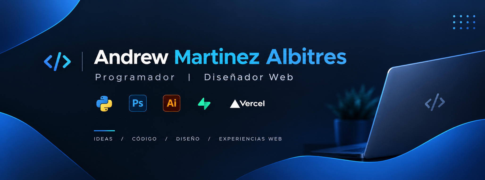

  

  
  
  

---

### 👋 ¡Hola! Soy Andrew Martínez Albitres, encantado de saludarte.

* 🎨💻 **Diseñador Gráfico, Diseñador Web y Full-Stack Software Engineer**. Poseo un enfoque híbrido que fusiona la estética visual y la experiencia de usuario (UX/UI) con una sólida ingeniería de software.
* 🚀 **Desarrollo de Software & SaaS:** Me especializo en construir arquitecturas web modernas y escalables. Actualmente lidero el desarrollo de **Vanty ABA** (una plataforma B2B enfocada en centros clínicos) y diversos proyectos de software a medida para optimizar procesos en América Latina.
* 🛠️ **Stack Tecnológico:** Trabajo de manera fluida con tecnologías modernas como Next.js, React, TypeScript, Tailwind CSS, Supabase, PostgreSQL, Node.js y Python.
* 🎯 **Enfoque actual:** Apasionado por el ecosistema indie maker, la automatización con inteligencia artificial y la creación de interfaces limpias, funcionales y de alto impacto visual tanto en código como en diseño digital.

---

### 🛠️ Tecnologías que utilizo:

  
  
  
  
  
  
  
  

### ⚙️ Entornos de desarrollo y control de versiones:

  
  
  
  

### 🎨 Herramientas de Diseño:

  
  
  
  
  

---

  <i>"Diseñando experiencias visuales y construyendo software robusto."</i>

